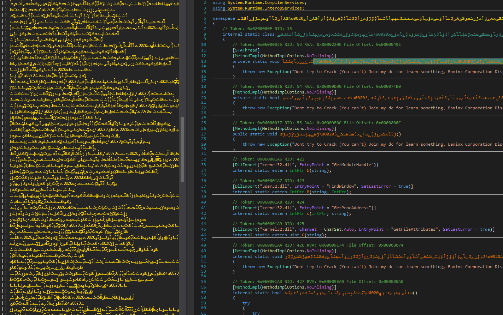
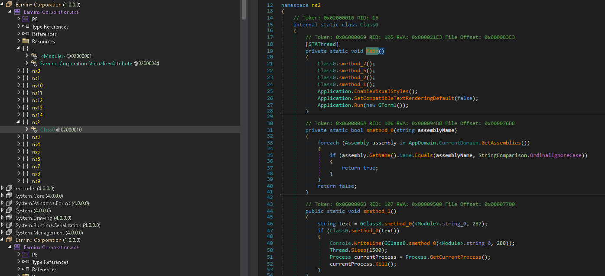

# SecureByteJITunpacker
Tool to fully remove JITing and recover MSIL from SecureByte protected assemblies.

## Before and after on a protected assembly. Used: [Namespace-Cleaner](https://github.com/GuardianN06/Namespace-Cleaner), [de4dot](https://github.com/de4dot/de4dot)

<p align="center">
  
  
</p>

```
Usage: SecureByteJITunpacker <assembly-path>
```
